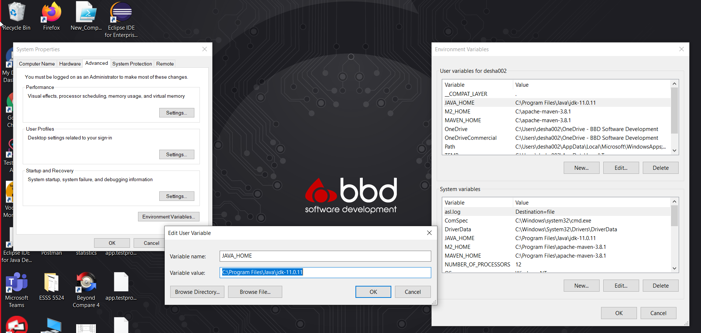
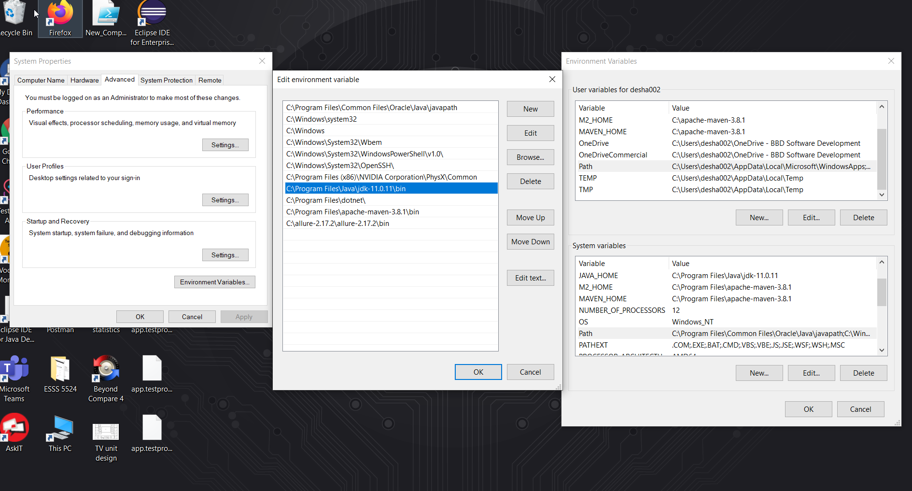
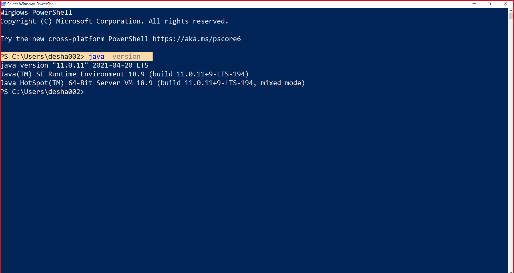
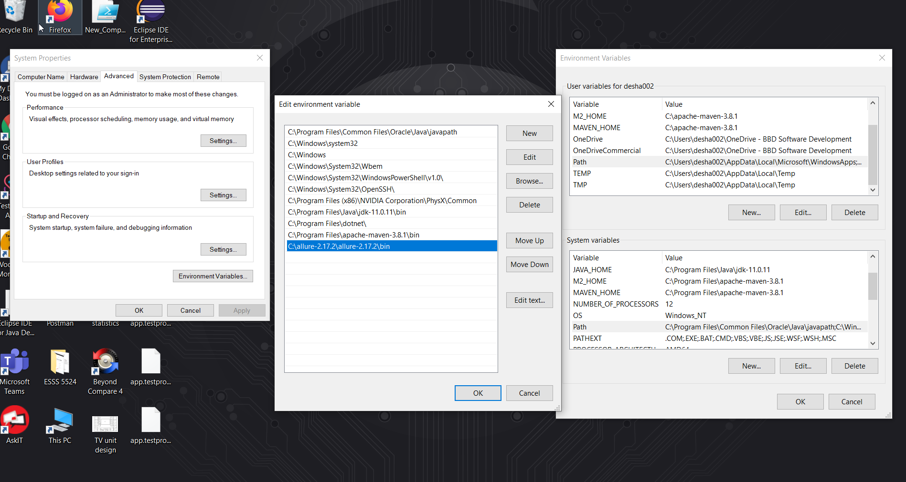
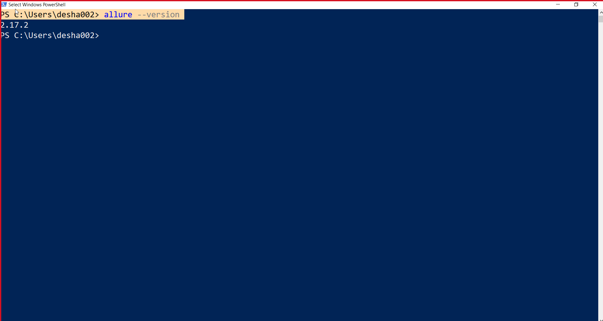

# RestAssured
## Installation Tools and softwares

* **Download latest JDK version using following link and Install in your system**

  <https://www.oracle.com/java/technologies/downloads/>
  
* **Set Envrionment variable for JAVA_HOME**


  ``JAVA_HOME :"C:\Program Files\Java\jdk-11.0.11"``
  
***
  
  
  
* **Set Envrionment variable for JDK Path**
  
  ``path      :"C:\Program Files\Java\jdk-11.0.11\bin"``
 
***
  
  
  
  
* **To check JDK Version hit below command**
 
  ```
  java -version
  ```
***
  
  
  
  
* **Download Eclipse using following link and Install in your system**

  <https://www.eclipse.org/downloads/>
  
* **Download Maven Binary zip file using following link and extract to your system**

  <https://maven.apache.org/download.cgi>
  
* **Download Allure zip file using following link**

  <https://github.com/allure-framework/allure2/releases>
  
* **Set Environment variable for Allure**

  ``path :"Allure path upto /bin folder"``
  
***
  
  
  
  
* **To check Allure Version hit below command** 

  ```
  allure --version
  ```
***
  
  
  
  
  
## Required Dependencies

### Get all belows Dependencies using following link

  <https://mvnrepository.com/artifact/org.apache.maven>
   
* **TestNG**

  TestNG that allows a test method to depend on a single or a group of test methods. This will help in executing a set of tests to be executed before a test method.
  
  
* **Cucumber JVM: Java**

  Cucumber is an open-source software test automation framework for behavior-driven development. It uses a business-readable, domain-specific language called Gherkin for        specifying feature behaviors that become tests
  
  
* **REST Assured**

  We use here RestAssured Depedency to include  RestAssured method from RestAssured class into this framework.
  
  
* **Allure TestNG**

  We use here Allure TestNG dependency to generate Proper allure result in this Framework, its include detailed test analysis report.
  
  
* **Cucumber-TestNG**

  We use here Cucumber-TestNG dependency to integrate cucumber BDD framework into TestNG, which is helped to run test cases in parallel execution or in a group execution.
  for that we create here testng.xml file to arrange TestCases from this framework
  
  
* **Json Simple**

  Sometimes we need to send Json format in our request URL though body for that we can use Json Simple dependency, which Mapped Strings and converted into Json format so we can passed whenever we need Json formated data
  
 
 
## Commands for Framework Execution
```
mvn install
```
 This is one time command,This command builds the maven project and installs the project files (JAR, WAR, pom.xml, etc) to the local repository.
***
```
mvn clean 
```
This command cleans the maven project by deleting the target directory.
***
```
mvn compile 
```
It’s used to compile the source Java classes of the project.
***
```
mvn test 
```
This command is used to run the test cases of the project using the maven-surefire-plugin.
***
```
allure generate 
```
To generate allure report into project directory
***
```
allure open 
```
To open allure reports in browser
***
  
  
